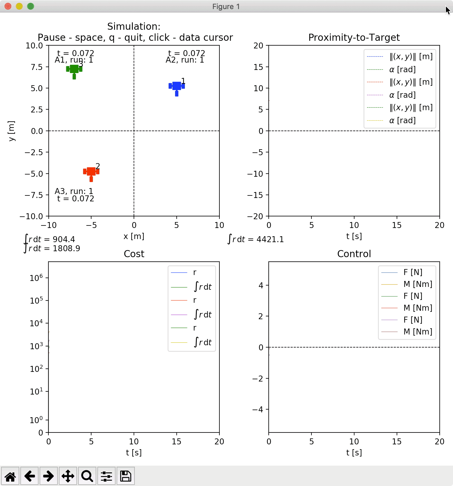

<p align="center">
	
</p>

<p align="center">
<br />
<br />
Rcognita is a framework for DP and RL algorithm development, testing, and simulation.
</p>

<p align="center">

</p>

<p align="center">
Above, a demonstration of controller *sample time* versus *prediction step size*. Each agent demonstrates varying performance in minimizing loss depending on how often it samples the environment versus how often it takes actions.
</p>

Example of terminal comand:
```{r, engine='bash', count_lines}
python3 main_3wrobot.py --mode 5 --ndots 20 --radius 5 --dt 0.05
```
Arguments for command line for single run:
- mode - *default 3*
- dt - *default 0.05*
- Nactor - *default 6*
- pred_step_size - *default 5*
- init_x - used only if one point required and only with init_y and init_alpha *default None*
- init_y - used only if one point required and only with init_x and init_alpha *default None*
- init_alpha - could be used separetely for one point (without init_x and init_y) *default None*
- ndots - number of dots for simulation *default 25*
- radius - *default 5*
- folder - *default None will be created folder with name of current hour*
- is_log_data - saving date in csv file in folder data/date/hour(or_name) *default True*
- is_print_sim_step - printing info about each step in terminal *default False*
- is_visualization - will visualize interface of rcognita and all process *default False*

If you need a series of experiments with variable parameters, then use bash script **itter**.
***Argument only for itter***
- is_bash -*default False*
- dt_bash *default 1*
bash won't work with float number, so we use for dt_bash in number and in code, if flag is_bash == True dt_bash will be multiplied with 0.001

