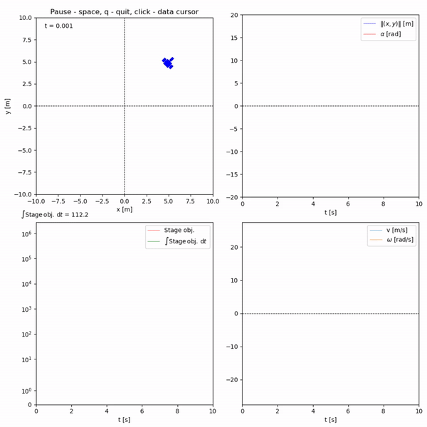

	

`rcognita` is a framework for hybrid agent-enviroment simultion.
The hybrid setting here means the actions are updated at discrete moments in time, whereas the environment dynamics are modelled time-continuous.
A detailed documentation is available [here](https://aidynamicaction.github.io/rcognita/).

## Example run with a mobile robot simulation

	

# General description

`rcognita` Python package is designed for hybrid simulation of agents and environments (generally speaking, not necessarily reinforcement learning agents).
Its main idea is to have an explicit implementation of sampled controls with user-defined sampling time specification.
The package consists of several modules, namely, `controllers`, `loggers`, `models`, `simulator`, `systems`, `utilities`, `visuals` and a collection of main modules (presets) for each agent-environment configuration.
[This flowchart](./docs/flowcharts/rcognita-flowchart-RLstab.pdf) shows interaction of the core `rcognita` classes contained in the said modules (the latter are not shown on the diagram).
The main module, or preset for the 3-wheel robot in this case, is shown in yellow.
It initializes the system (the environment), the controllers (the agents, e. g., a safe agent, a benchmarking agent, a reinforcement learning agent etc.), the visualization engine called animator, the logger and the simulator.
The latter is a multi-purpose device for simulating agent-environment loops of different types (specified by sys type).
Depending on sys type, the environment can either be described by a differential equation (including stochastic ones), a difference equation (for discrete-time systems), or by a probability distribution (for, e. g., Markov decision processes).
The parameter `dt` determines the maximal step size for the numerical solver in case of differential equations.
The main method of this class is sim step which performs one solver step, whereas reset re-initializes the simulator after an episode.
The logger class is an interface defining stubs of a print-to-console method print sim step, and print-to-file method log data row, respectively.
Concrete loggers realize these methods.
A similar class inheritance scheme is used in animator, and system.
The core data of animator’s subclasses are `objects`, which include entities to be updated on the screen, and their parameters stored in `pars`.
A concrete realization of a system interface must realize `sys_dyn`, which is the “right-handside” of the environment description, optionally disturbance dynamics via `disturb_dyn`, optionally controller dynamics (if the latter is, e. g., time-varying), and the output function `out`.
The method `receive_action` gets a control action and stores it.
Everything is packed together in the `closed_loop_rhs` for the use in `simulator`.
Finally, the `controllers` module contains various agent types.
One of them is `ctrl_RL_stab` – the class of stabilizing reinforcement learning agents as shown in [this flowchart](./docs/flowcharts/rcognita-flowchart-RLstab.pdf).
Notice it contains an explicit specification of the sampling time.
The data `safe_ctrl` is required to specify the stabilizing constraints and also to initialize the optimizer inside the `actor_critic` method, which in turns fetches the cost function from the `actor_critic_cost` method.
The method `compute_action` essentially watches the internal clock and performs an action updates when a time sample has elapsed.
Auxiliary modules of the package are `models` and `utilities` which provide auxiliary functions and data structures, such as neural networks.
